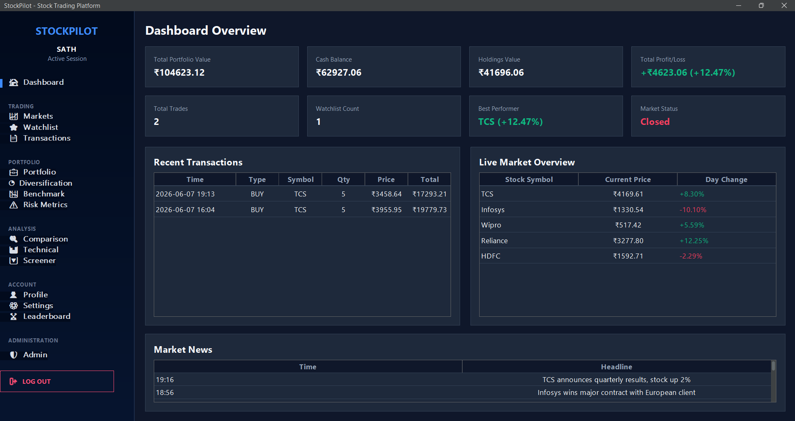
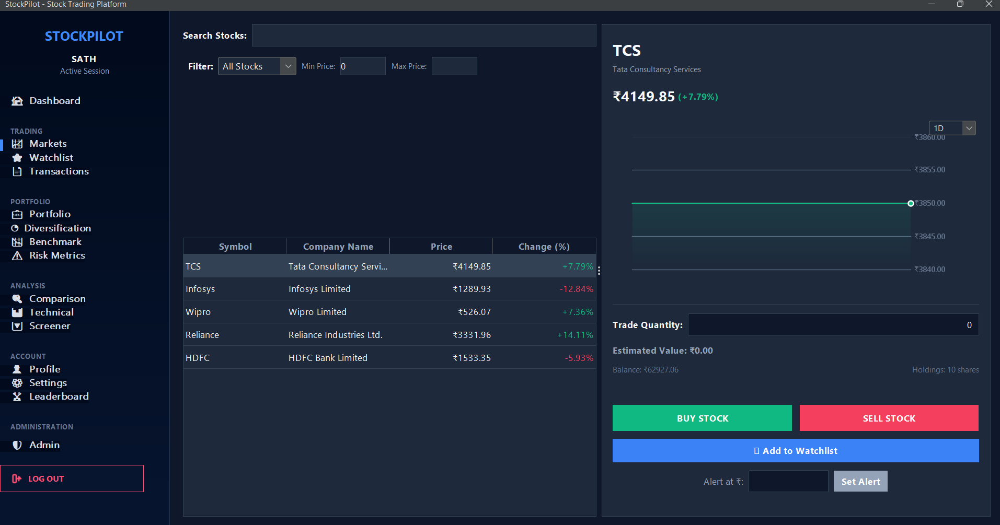
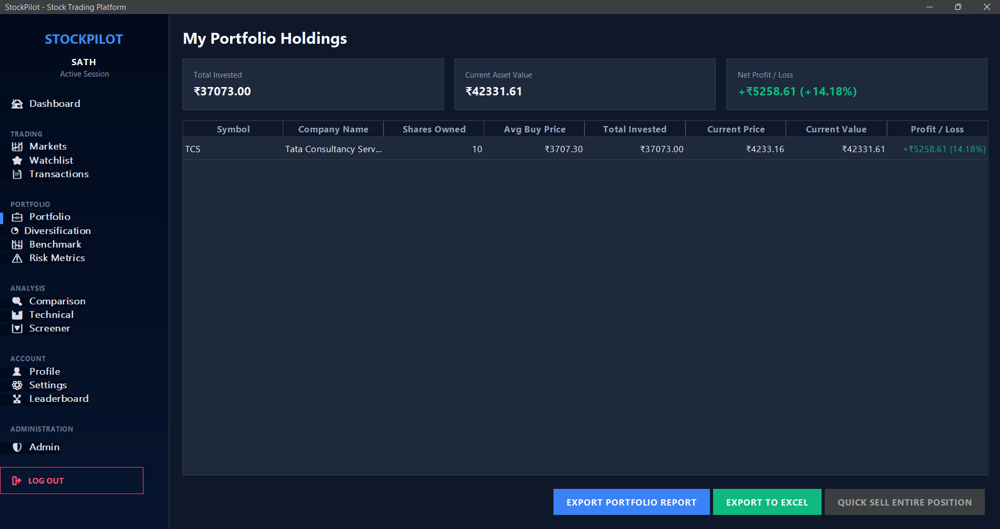
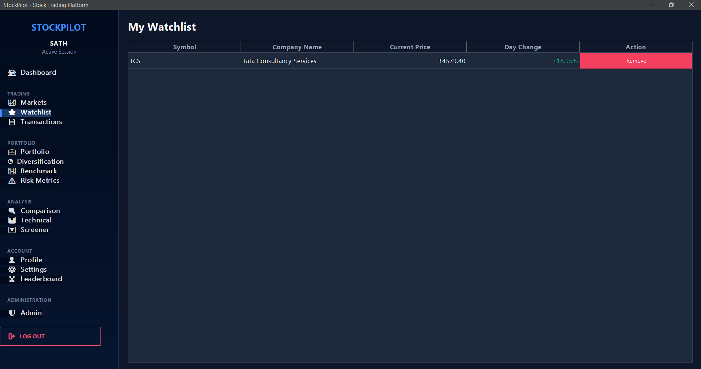
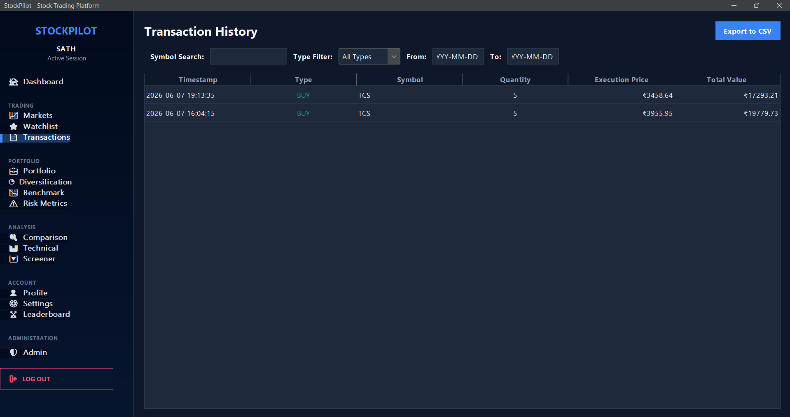
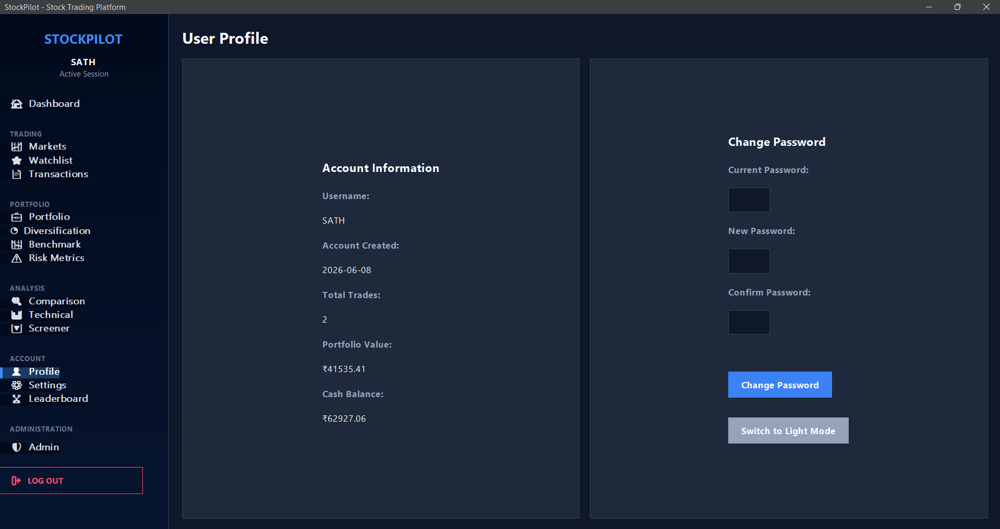
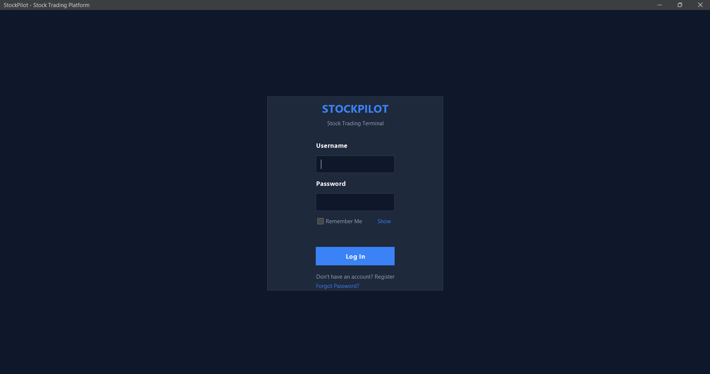

# StockPilot | Java Swing Stock Trading Simulator

A professional Java Swing-based stock trading simulation application with real-time price updates, portfolio management, and comprehensive analytics.


## Features

### Core Trading Features
- **Real-time Stock Price Simulation** - Live price updates every 2-3 seconds
- **Buy/Sell Stocks** - Execute trades with instant portfolio updates
- **Multi-user Support** - Separate accounts with individual portfolios
- **Virtual Balance** - Start with ₹100,000 virtual currency
- **Transaction History** - Complete record of all trades

### Portfolio Management
- **Portfolio Overview** - View all holdings with real-time valuation
- **Profit/Loss Analytics** - Track performance per stock and overall
- **Best/Worst Performers** - Identify top and bottom performing stocks
- **Quick Sell** - Sell entire positions with one click
- **Portfolio Performance Chart** - Visualize portfolio growth over time

### Market Features
- **Stock Search & Filtering** - Search by symbol/company name
- **Gainers/Losers Filter** - Filter stocks by daily performance
- **Price Range Filter** - Filter stocks by price range
- **Live Market Overview** - Real-time market data display
- **Stock Price Charts** - Historical price visualization

### User Features
- **User Profile Management** - View account details and statistics
- **Password Change** - Secure password update functionality
- **Account Creation Date Tracking** - Track when accounts were created
- **Trade Statistics** - Total trades count and portfolio value

### Advanced Features
- **Watchlist/Favorites** - Save and track favorite stocks
- **CSV Export** - Export transaction history to CSV format
- **Buy/Sell Confirmation Dialogs** - Professional trade confirmation
- **Trade Quantity Input Validation** - Prevent invalid trade quantities
- **Dashboard Analytics** - Comprehensive portfolio statistics
- **Market Status Indicator** - Real-time market open/closed status

## Screenshots

### Dashboard

- Portfolio value overview
- Cash balance display
- Holdings value tracking
- Total profit/loss calculation
- Total trades count
- Watchlist count
- Best performing stock
- Market status indicator
- Recent transactions table
- Live market overview
- Market news feed

### Markets

- Advanced search and filtering
- Stock price charts
- Buy/Sell functionality
- Add to watchlist
- Trade confirmation dialogs

### Portfolio

- Holdings table with detailed metrics
- Performance chart over time
- Best/worst performer cards
- Quick sell functionality
- CSV export option

### Watchlist

- Favorite stocks display
- Real-time price updates
- Remove from watchlist
- Quick access to trade

### Transactions

- Complete transaction history
- Search by symbol
- Filter by transaction type
- Export to CSV

### Profile

- Account information
- Password change
- Trade statistics
- Portfolio value summary

### Login

- Secure login system
- User authentication
- Modern UI design
- Multi-user account support

## Technologies Used

- **Java 17** - Core programming language
- **Java Swing** - GUI framework
- **FlatLaf** - Modern Look and Feel library
- **File-based Storage** - Properties and text files for data persistence
- **SHA-256** - Password hashing (for demonstration purposes)

## Project Structure

```
CodeAlpha-Stock-Trading-Platform/
├── Main.java                    # Application entry point
├── AuthManager.java             # User authentication
├── StorageManager.java         # Data persistence
├── StockManager.java           # Stock data and simulation
├── TradingManager.java         # Trade execution logic
├── User.java                   # User model
├── Stock.java                  # Stock model
├── Holding.java                # Portfolio holding model
├── Transaction.java            # Transaction model
├── MainFrame.java              # Main application window
├── LoginScreen.java            # Login/registration UI
├── DashboardScreen.java        # Dashboard overview
├── MarketsScreen.java          # Stock market and trading
├── PortfolioScreen.java        # Portfolio management
├── TransactionsScreen.java     # Transaction history
├── WatchlistScreen.java        # Watchlist management
├── ProfileScreen.java          # User profile
├── StockChartPanel.java        # Stock price chart
├── PortfolioChartPanel.java    # Portfolio performance chart
├── Theme.java                  # UI theme constants
├── data/                       # User data directory
│   ├── users.properties        # User credentials
│   └── <username>/             # Per-user data
│       ├── profile.properties  # User profile
│       ├── portfolio.txt        # Portfolio holdings
│       ├── transactions.txt    # Transaction history
│       └── watchlist.txt        # Watchlist
└── README.md                   # This file
```

## How to Run

### Prerequisites
- Java Development Kit (JDK) 17 or higher
- FlatLaf library (included in project)

### Compilation
```bash
javac -cp ".;lib\flatlaf-3.7.1.jar" *.java
```

### Running the Application
```bash
java -cp ".;lib\flatlaf-3.7.1.jar" Main
```

### Using the Compile Script (Windows)
```powershell
powershell -ExecutionPolicy Bypass -File compile_and_run.ps1
```

## Usage Guide

### Getting Started
1. Run the application
2. Register a new account or login with existing credentials
3. Start with ₹100,000 virtual balance
4. Explore the dashboard to see market overview

### Trading Stocks
1. Navigate to the "Markets" tab
2. Search or filter stocks
3. Select a stock to view details
4. Enter quantity and click Buy or Sell
5. Confirm the trade in the dialog
6. View updated portfolio in Portfolio tab

### Managing Portfolio
1. View all holdings in Portfolio tab
2. See performance charts
3. Use Quick Sell to exit positions
4. Track best/worst performers

### Using Watchlist
1. Click "★ Add to Watchlist" on any stock
2. Access Watchlist tab to view favorites
3. Remove stocks from watchlist as needed

### Exporting Transactions
1. Go to Transactions tab
2. Click "Export to CSV"
3. Choose save location
4. Transaction history exported to CSV file

### Changing Password
1. Navigate to Profile tab
2. Enter current password
3. Enter new password (minimum 6 characters)
4. Confirm new password
5. Click "Change Password"

## Data Storage

The application uses file-based storage for simplicity:
- User credentials: `data/users.properties`
- User profiles: `data/<username>/profile.properties`
- Portfolio: `data/<username>/portfolio.txt`
- Transactions: `data/<username>/transactions.txt`
- Watchlist: `data/<username>/watchlist.txt`

**Note:** Passwords are hashed using SHA-256 for demonstration. For production use, consider using BCrypt or similar secure hashing algorithms.

## Future Enhancements

- **PDF Export** - Export transactions and portfolio reports to PDF
- **Database Integration** - Replace file storage with MySQL/PostgreSQL
- **Secure Password Hashing** - Implement BCrypt for password security
- **Stock Price Alerts** - Notification system for price thresholds
- **Market News Section** - Real-time financial news integration
- **Settings Page** - Theme switching, refresh rate configuration
- **Admin Dashboard** - User management and system monitoring
- **Leaderboard** - Compare performance with other users
- **Forgot Password** - Password recovery functionality
- **Advanced Charts** - Candlestick charts, technical indicators
- **API Integration** - Real stock market data integration

## Known Limitations

- File-based storage (not scalable for large deployments)
- Simulated stock prices (not real market data)
- SHA-256 password hashing (consider BCrypt for production)
- No database integration
- Limited to single machine (no network support)

## Security Considerations

- Passwords are hashed before storage
- User data is isolated per account
- Input validation on trade quantities
- Confirmation dialogs for all trades
- No SQL injection risk (file-based storage)

**Important:** This is a simulation platform for educational purposes. Do not use with real money or sensitive financial data.

## License

This project is created for educational purposes as part of the CodeAlpha internship program.

## Author

## Author

Sathwika Dondapati
Computer Science Engineering Student
Aspiring Software Engineer 

## Acknowledgments

- FlatLaf library for modern UI components
- Java Swing for GUI framework
- CodeAlpha for the internship opportunity

---

**Version:** 2.0  
**Last Updated:** June 2026
